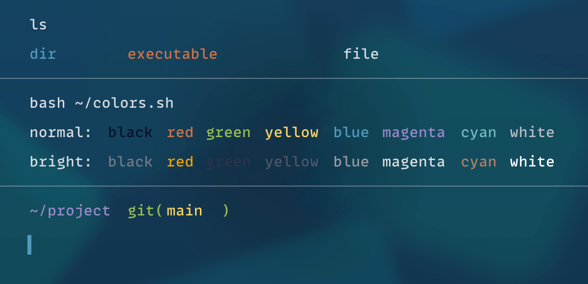

# Warp Shimmer


A refined version of the official Warp terminal theme with its signature blue accent and dark background. The Warp logo has been removed from the background image for a cleaner, distraction-free appearance.

## Available Variants

| Theme | Preview |
| --- | --- |
| **Warp Shimmer** - Clean theme with refined background |  |
| **Warp Shimmer Dark** - Darker variant for enhanced focus |  |

## Installation

```bash
# Clone the repository
git clone https://github.com/silouanwright/warp-shimmer.git

# Install themes
cp warp-shimmer/warp/* ~/.warp/themes/        # Standard theme
cp warp-shimmer/warp_darker/* ~/.warp/themes/  # Darker variant
```

## Using the Theme
1. Open Warp settings (⌘+,)
2. Go to Appearance → Themes
3. Select "Warp Shimmer" or "Warp Shimmer Dark" from the theme list

## Theme Colors

- **Accent**: `#5299bf` (Blue)
- **Background**: `#061229` (Dark Navy)
- **Foreground**: `#d8dbe2` (Soft White - slightly adjusted for better readability)

## Features

- Original Warp theme colors and settings
- Custom background image with 60% opacity (Warp logo removed)
- Dark theme optimized for long coding sessions
- Carefully selected terminal colors for optimal readability

## Based on the Original Warp Theme

Warp Shimmer is based on the official [Warp theme](https://github.com/warpdotdev/themes/tree/main/warp_bundled) that comes bundled with Warp Terminal.

### Refinements from the original:
- The Warp logo has been masked out from the background image for a cleaner, distraction-free appearance
- Foreground text color slightly brightened from `#b8bbc2` to `#d8dbe2` for improved readability
- All other color values and settings remain the same as the original

Original theme location: `~/.warp/themes/warp_bundled/warp.yaml`